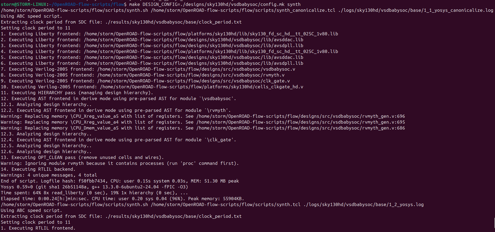
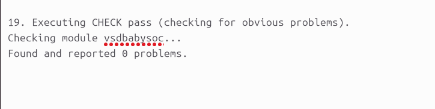
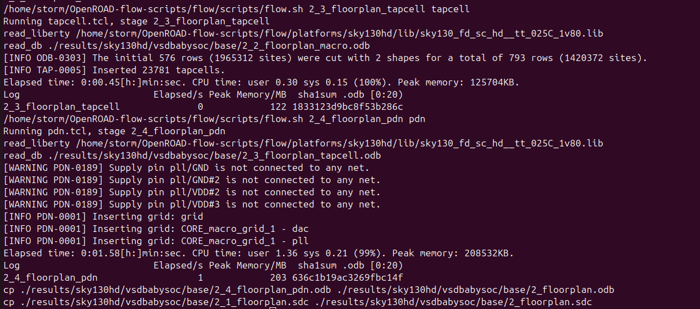
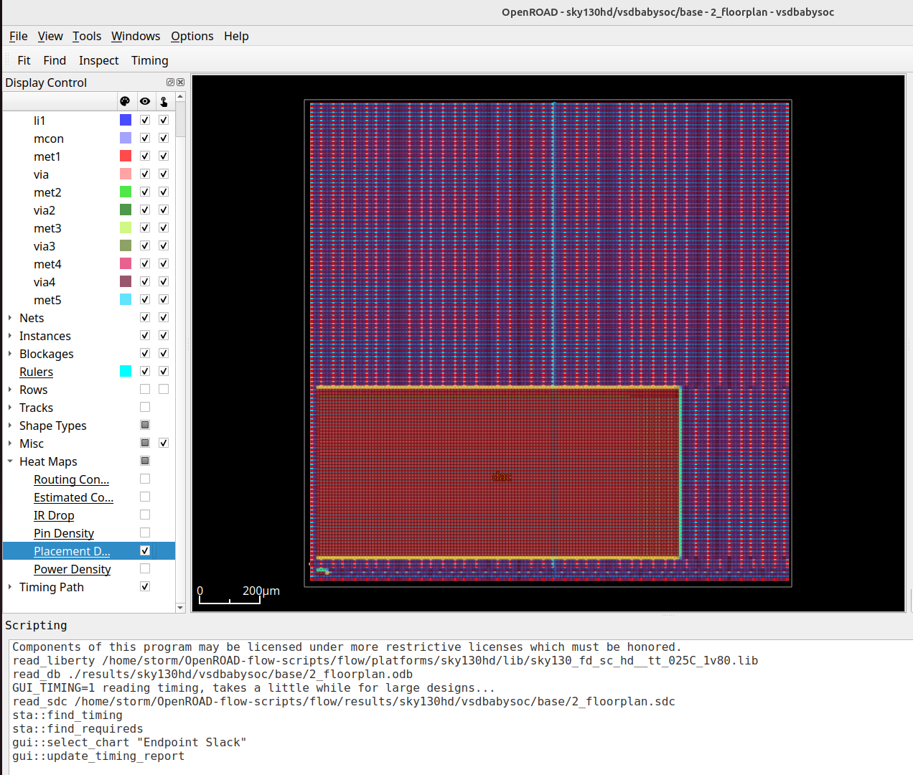
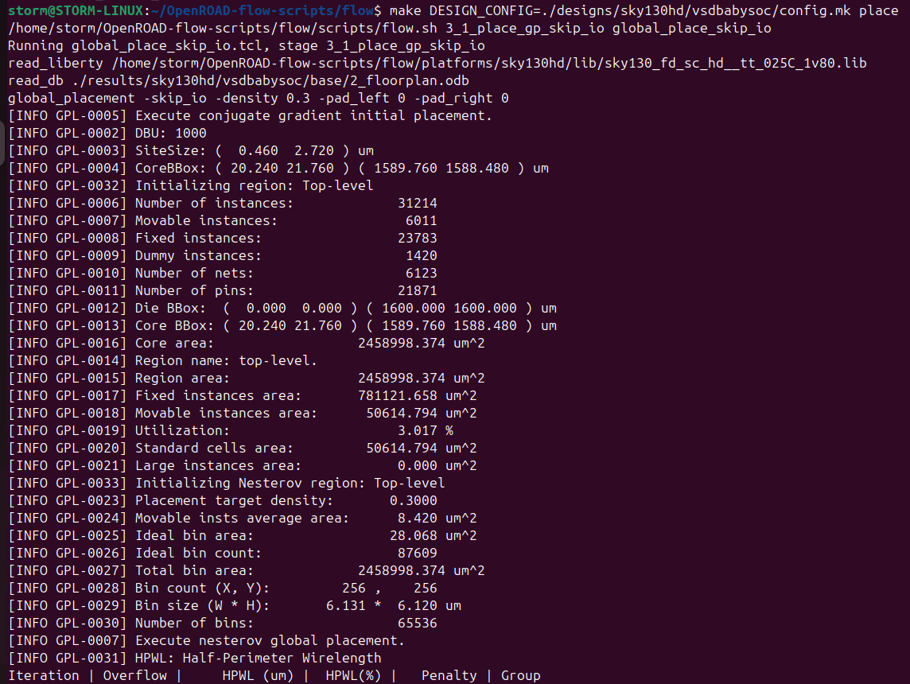
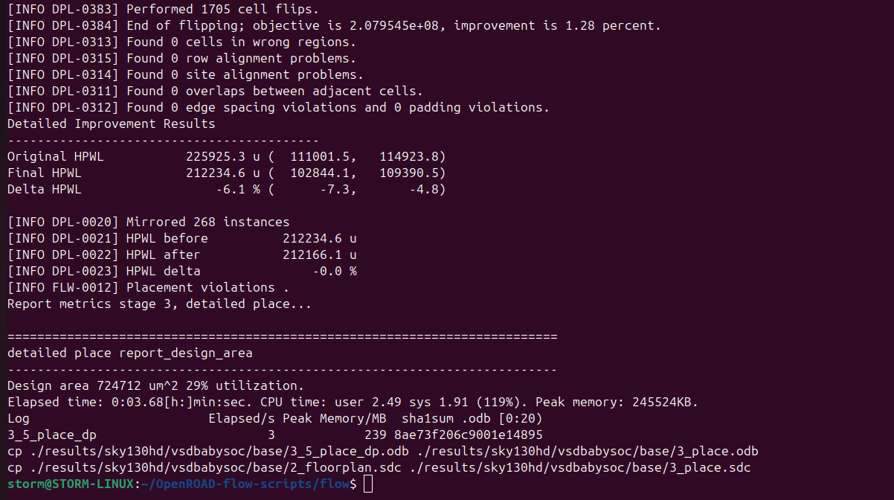
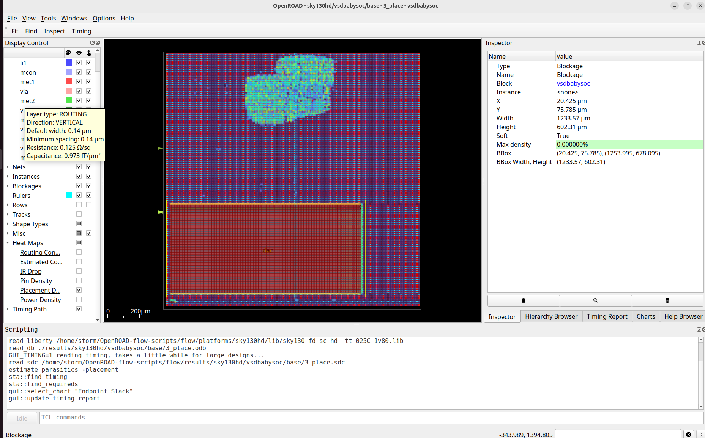
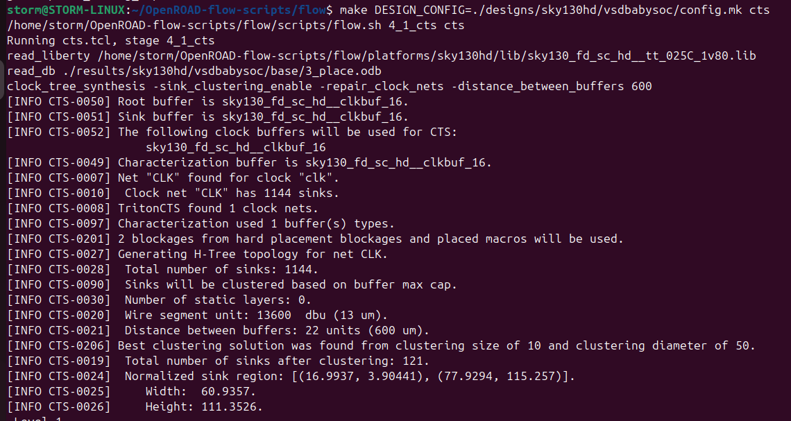
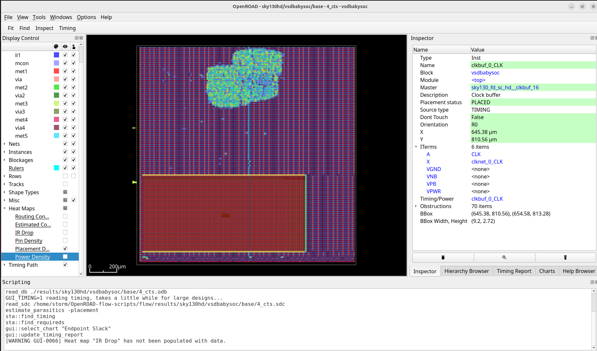

# Week 7 - My RISC-V SoC Tapeout Journey

**Author:** Goutham Badhrinath V  

---

## 📘 Baby SoC Physical Design

**Installing and setting up ORFS**

```
git clone --recursive https://github.com/The-OpenROAD-Project/OpenROAD-flow-scripts
cd OpenROAD-flow-scripts
sudo ./setup.sh
```

```
./build_openroad.sh --local
```


**Verify Installation**

```
source ./env.sh
yosys -help
openroad -help
cd flow
make
```


```
make gui_final
```


**ORFS Directory Structure and File formats**


``` 
├── OpenROAD-flow-scripts             
│   ├── docker           -> It has Docker based installation, run scripts and all saved here
│   ├── docs             -> Documentation for OpenROAD or its flow scripts.  
│   ├── flow             -> Files related to run RTL to GDS flow  
|   ├── jenkins          -> It contains the regression test designed for each build update
│   ├── tools            -> It contains all the required tools to run RTL to GDS flow
│   ├── etc              -> Has the dependency installer script and other things
│   ├── setup_env.sh     -> Its the source file to source all our OpenROAD rules to run the RTL to GDS flow
```

Now, go to flow directory

``` 
├── flow           
│   ├── design           -> It has built-in examples from RTL to GDS flow across different technology nodes
│   ├── makefile         -> The automated flow runs through makefile setup
│   ├── platform         -> It has different technology note libraries, lef files, GDS etc 
|   ├── tutorials        
│   ├── util            
│   ├── scripts             
```

Automated RTL2GDS Flow for VSDBabySoC:

Initial Steps:

- We need to create a directory `vsdbabysoc` inside `OpenROAD-flow-scripts/flow/designs/sky130hd`
- Now create a directory `vsdbabysoc` inside `OpenROAD-flow-scripts/flow/designs/src` and include all the verilog files here.
- Now copy the folders `gds`, `include`, `lef` and `lib` from the VSDBabySoC folder in your system into this directory.
  - The `gds` folder would contain the files `avsddac.gds` and `avsdpll.gds`
  - The `include` folder would contain the files `sandpiper.vh`, `sandpiper_gen.vh`, `sp_default.vh` and `sp_verilog.vh`
  - The `gds` folder would contain the files `avsddac.lef` and `avsdpll.lef`
  - The `lib` folder would contain the files `avsddac.lib` and `avsdpll.lib`
- Now copy the constraints file(`vsdbabysoc_synthesis.sdc`) from the VSDBabySoC folder in your system into this directory.
- Now copy the files(`macro.cfg` and `pin_order.cfg`) from the VSDBabySoC folder in your system into this directory.
- Now, create a `config.mk` file whose contents are shown below:

```
export DESIGN_NICKNAME = vsdbabysoc
export DESIGN_NAME = vsdbabysoc
export PLATFORM    = sky130hd

# export VERILOG_FILES_BLACKBOX = $(DESIGN_HOME)/src/$(DESIGN_NICKNAME)/IPs/*.v
# export VERILOG_FILES = $(sort $(wildcard $(DESIGN_HOME)/src/$(DESIGN_NICKNAME)/*.v))
# Explicitly list the Verilog files for synthesis
export VERILOG_FILES = $(DESIGN_HOME)/src/$(DESIGN_NICKNAME)/vsdbabysoc.v \
                       $(DESIGN_HOME)/src/$(DESIGN_NICKNAME)/rvmyth.v \
                       $(DESIGN_HOME)/src/$(DESIGN_NICKNAME)/clk_gate.v

export SDC_FILE      = $(DESIGN_HOME)/$(PLATFORM)/$(DESIGN_NICKNAME)/vsdbabysoc_synthesis.sdc

export vsdbabysoc_DIR = $(DESIGN_HOME)/$(PLATFORM)/$(DESIGN_NICKNAME)

export VERILOG_INCLUDE_DIRS = $(wildcard $(vsdbabysoc_DIR)/include/)
# export SDC_FILE      = $(wildcard $(vsdbabysoc_DIR)/sdc/*.sdc)
export ADDITIONAL_GDS  = $(wildcard $(vsdbabysoc_DIR)/gds/*.gds.gz)
export ADDITIONAL_LEFS  = $(wildcard $(vsdbabysoc_DIR)/lef/*.lef)
export ADDITIONAL_LIBS = $(wildcard $(vsdbabysoc_DIR)/lib/*.lib)
# export PDN_TCL = $(DESIGN_HOME)/$(PLATFORM)/$(DESIGN_NICKNAME)/pdn.tcl

# Clock Configuration (vsdbabysoc specific)
# export CLOCK_PERIOD = 20.0
export CLOCK_PORT = CLK
export CLOCK_NET = $(CLOCK_PORT)

# Floorplanning Configuration (vsdbabysoc specific)
export FP_PIN_ORDER_CFG = $(wildcard $(DESIGN_DIR)/pin_order.cfg)
# export FP_SIZING = absolute

export DIE_AREA   = 0 0 1600 1600
export CORE_AREA  = 20 20 1590 1590

# Placement Configuration (vsdbabysoc specific)
export MACRO_PLACEMENT_CFG = $(wildcard $(DESIGN_DIR)/macro.cfg)
export PLACE_PINS_ARGS = -exclude left:0-600 -exclude left:1000-1600: -exclude right:* -exclude top:* -exclude bottom:*
# export MACRO_PLACEMENT = $(DESIGN_HOME)/$(PLATFORM)/$(DESIGN_NICKNAME)/macro_placement.cfg

export TNS_END_PERCENT = 100
export REMOVE_ABC_BUFFERS = 1

# Magic Tool Configuration
export MAGIC_ZEROIZE_ORIGIN = 0
export MAGIC_EXT_USE_GDS = 1

# CTS tuning
export CTS_BUF_DISTANCE = 600
export SKIP_GATE_CLONING = 1

# export CORE_UTILIZATION=0.1  # Reduce this value to allow more whitespace for routing.
```

Now go to terminal and run the following commands:

```
cd OpenROAD-flow-scripts
source env.sh
cd flow
```

Commands for **synthesis**:

```
make DESIGN_CONFIG=./designs/sky130hd/vsdbabysoc/config.mk synth
```




Synthesis log:



Synthesis Stats:

```

20. Printing statistics.

=== vsdbabysoc ===

        +----------Local Count, excluding submodules.
        |        +-Local Area, excluding submodules.
        |        | 
     6715        - wires
     6715        - wire bits
     1285        - public wires
     1285        - public wire bits
        7        - ports
        7        - port bits
     6605 5.29E+04 cells
        1        -   avsddac
        1        -   avsdpll
        1   11.261   sky130_fd_sc_hd__a2111o_1
        6    52.55   sky130_fd_sc_hd__a2111oi_0
        8   70.067   sky130_fd_sc_hd__a211o_1
       26  195.187   sky130_fd_sc_hd__a211oi_1
       17  127.622   sky130_fd_sc_hd__a21boi_0
       31  232.723   sky130_fd_sc_hd__a21o_1
      884 4.42E+03   sky130_fd_sc_hd__a21oi_1
        7   61.309   sky130_fd_sc_hd__a21oi_2
       15  150.144   sky130_fd_sc_hd__a221o_1
       37  324.061   sky130_fd_sc_hd__a221oi_1
       24  210.202   sky130_fd_sc_hd__a22o_1
      222 1.67E+03   sky130_fd_sc_hd__a22oi_1
        1    21.27   sky130_fd_sc_hd__a22oi_4
        1   11.261   sky130_fd_sc_hd__a2bb2o_2
        4   35.034   sky130_fd_sc_hd__a2bb2oi_1
        2   20.019   sky130_fd_sc_hd__a311o_1
       15  131.376   sky130_fd_sc_hd__a311oi_1
        8   70.067   sky130_fd_sc_hd__a31o_2
       53  331.568   sky130_fd_sc_hd__a31oi_1
        1    10.01   sky130_fd_sc_hd__a32o_1
        3   26.275   sky130_fd_sc_hd__a32oi_1
        3   26.275   sky130_fd_sc_hd__a41oi_1
        2   12.512   sky130_fd_sc_hd__and2_0
       10    62.56   sky130_fd_sc_hd__and2_1
       14   87.584   sky130_fd_sc_hd__and3_1
       34  127.622   sky130_fd_sc_hd__buf_1
        9   45.043   sky130_fd_sc_hd__buf_2
        1    7.507   sky130_fd_sc_hd__buf_4
        3   33.782   sky130_fd_sc_hd__buf_6
      548 2.06E+03   sky130_fd_sc_hd__clkbuf_1
        4   15.014   sky130_fd_sc_hd__clkinv_1
        1    3.754   sky130_fd_sc_hd__conb_1
     1144 2.29E+04   sky130_fd_sc_hd__dfxtp_1
        4   80.077   sky130_fd_sc_hd__fa_1
      100   1251.2   sky130_fd_sc_hd__ha_1
      104  390.374   sky130_fd_sc_hd__inv_1
       56  630.605   sky130_fd_sc_hd__mux2_2
       92  920.883   sky130_fd_sc_hd__mux2i_1
        1   22.522   sky130_fd_sc_hd__mux2i_4
       69  1553.99   sky130_fd_sc_hd__mux4_2
     1461  5484.01   sky130_fd_sc_hd__nand2_1
       28  175.168   sky130_fd_sc_hd__nand2b_1
      213 1.07E+03   sky130_fd_sc_hd__nand3_1
       40  300.288   sky130_fd_sc_hd__nand3b_1
       70   437.92   sky130_fd_sc_hd__nand4_1
        2   17.517   sky130_fd_sc_hd__nand4b_1
      284 1.07E+03   sky130_fd_sc_hd__nor2_1
       52  325.312   sky130_fd_sc_hd__nor2b_1
       74  370.355   sky130_fd_sc_hd__nor3_1
        9   67.565   sky130_fd_sc_hd__nor3b_1
        1   12.512   sky130_fd_sc_hd__nor3b_2
       25    156.4   sky130_fd_sc_hd__nor4_1
        1    8.758   sky130_fd_sc_hd__nor4b_1
        1   11.261   sky130_fd_sc_hd__o2111a_1
        8   70.067   sky130_fd_sc_hd__o2111ai_1
        3   30.029   sky130_fd_sc_hd__o211a_1
       51  382.867   sky130_fd_sc_hd__o211ai_1
       30  225.216   sky130_fd_sc_hd__o21a_1
      397 1.99E+03   sky130_fd_sc_hd__o21ai_0
        8   40.038   sky130_fd_sc_hd__o21ai_1
       10   75.072   sky130_fd_sc_hd__o21bai_1
       27  236.477   sky130_fd_sc_hd__o221ai_1
       36  315.302   sky130_fd_sc_hd__o22a_1
       31  193.936   sky130_fd_sc_hd__o22ai_1
        2   17.517   sky130_fd_sc_hd__o2bb2ai_1
        1    10.01   sky130_fd_sc_hd__o311a_1
        6    52.55   sky130_fd_sc_hd__o311ai_0
        5   43.792   sky130_fd_sc_hd__o31a_1
       34  255.245   sky130_fd_sc_hd__o31ai_1
        1   12.512   sky130_fd_sc_hd__o31ai_2
        2   20.019   sky130_fd_sc_hd__o32a_1
        4   35.034   sky130_fd_sc_hd__o32ai_1
        1   11.261   sky130_fd_sc_hd__o41a_1
        5   43.792   sky130_fd_sc_hd__o41ai_1
        2   12.512   sky130_fd_sc_hd__or2_0
        1    6.256   sky130_fd_sc_hd__or2_1
        8   50.048   sky130_fd_sc_hd__or2_2
       28  175.168   sky130_fd_sc_hd__or3_1
        1    8.758   sky130_fd_sc_hd__or3b_1
        2   17.517   sky130_fd_sc_hd__or3b_2
        4   30.029   sky130_fd_sc_hd__or4_1
       47  411.645   sky130_fd_sc_hd__xnor2_1
       22  192.685   sky130_fd_sc_hd__xor2_1

   Area for cell type \avsdpll is unknown!
   Area for cell type \avsddac is unknown!

   Chip area for module '\vsdbabysoc': 52874.460800
     of which used for sequential elements: 22901.964800 (43.31%)

```
Commands for **floorplan**:

```
make DESIGN_CONFIG=./designs/sky130hd/vsdbabysoc/config.mk floorplan
```




```
make DESIGN_CONFIG=./designs/sky130hd/vsdbabysoc/config.mk gui_floorplan
```


```
make DESIGN_CONFIG=./designs/sky130hd/vsdbabysoc/config.mk place
```





```
make DESIGN_CONFIG=./designs/sky130hd/vsdbabysoc/config.mk gui_place
```




```
make DESIGN_CONFIG=./designs/sky130hd/vsdbabysoc/config.mk cts
```



```
make DESIGN_CONFIG=./designs/sky130hd/vsdbabysoc/config.mk gui_cts
```




CTS final report:

```

==========================================================================
cts final report_tns
--------------------------------------------------------------------------
tns max 0.00

==========================================================================
cts final report_wns
--------------------------------------------------------------------------
wns max 0.00

==========================================================================
cts final report_worst_slack
--------------------------------------------------------------------------
worst slack max 6.06

==========================================================================
cts final report_clock_min_period
--------------------------------------------------------------------------
clk period_min = 4.94 fmax = 202.54

==========================================================================
cts final report_clock_skew
--------------------------------------------------------------------------
Clock clk
   1.27 source latency core.CPU_Xreg_value_a5[17][3]$_DFF_P_/CLK ^
  -0.87 target latency core.OUT[3]$_DFF_P_/CLK ^
   0.00 CRPR
--------------
   0.41 setup skew


==========================================================================
cts final report_checks -path_delay min
--------------------------------------------------------------------------
Startpoint: core.CPU_imm_a2[5]$_DFF_P_
            (rising edge-triggered flip-flop clocked by clk)
Endpoint: core.CPU_imm_a3[5]$_DFF_P_
          (rising edge-triggered flip-flop clocked by clk)
Path Group: clk
Path Type: min

Fanout     Cap    Slew   Delay    Time   Description
-----------------------------------------------------------------------------
                          0.00    0.00   clock clk (rise edge)
                          0.00    0.00   clock source latency
     1    0.30    0.00    0.00    0.00 ^ pll/CLK (avsdpll)
                                         CLK (net)
                  0.05    0.02    0.02 ^ clkbuf_0_CLK/A (sky130_fd_sc_hd__clkbuf_16)
     4    0.24    0.25    0.27    0.30 ^ clkbuf_0_CLK/X (sky130_fd_sc_hd__clkbuf_16)
                                         clknet_0_CLK (net)
                  0.25    0.02    0.31 ^ clkbuf_2_2_0_CLK/A (sky130_fd_sc_hd__clkbuf_16)
     4    0.13    0.14    0.27    0.58 ^ clkbuf_2_2_0_CLK/X (sky130_fd_sc_hd__clkbuf_16)
                                         clknet_2_2_0_CLK (net)
                  0.14    0.00    0.59 ^ clkbuf_4_10__f_CLK/A (sky130_fd_sc_hd__clkbuf_16)
     8    0.17    0.19    0.27    0.86 ^ clkbuf_4_10__f_CLK/X (sky130_fd_sc_hd__clkbuf_16)
                                         clknet_4_10__leaf_CLK (net)
                  0.19    0.00    0.86 ^ clkbuf_leaf_38_CLK/A (sky130_fd_sc_hd__clkbuf_16)
    13    0.04    0.06    0.19    1.05 ^ clkbuf_leaf_38_CLK/X (sky130_fd_sc_hd__clkbuf_16)
                                         clknet_leaf_38_CLK (net)
                  0.06    0.00    1.05 ^ core.CPU_imm_a2[5]$_DFF_P_/CLK (sky130_fd_sc_hd__dfxtp_1)
     2    0.01    0.06    0.33    1.38 v core.CPU_imm_a2[5]$_DFF_P_/Q (sky130_fd_sc_hd__dfxtp_1)
                                         core.CPU_imm_a2[5] (net)
                  0.06    0.00    1.38 v core.CPU_imm_a3[5]$_DFF_P_/D (sky130_fd_sc_hd__dfxtp_1)
                                  1.38   data arrival time

                          0.00    0.00   clock clk (rise edge)
                          0.00    0.00   clock source latency
     1    0.30    0.00    0.00    0.00 ^ pll/CLK (avsdpll)
                                         CLK (net)
                  0.05    0.02    0.02 ^ clkbuf_0_CLK/A (sky130_fd_sc_hd__clkbuf_16)
     4    0.24    0.25    0.27    0.30 ^ clkbuf_0_CLK/X (sky130_fd_sc_hd__clkbuf_16)
                                         clknet_0_CLK (net)
                  0.25    0.02    0.31 ^ clkbuf_2_3_0_CLK/A (sky130_fd_sc_hd__clkbuf_16)
     4    0.19    0.20    0.31    0.63 ^ clkbuf_2_3_0_CLK/X (sky130_fd_sc_hd__clkbuf_16)
                                         clknet_2_3_0_CLK (net)
                  0.20    0.00    0.63 ^ clkbuf_4_12__f_CLK/A (sky130_fd_sc_hd__clkbuf_16)
     8    0.35    0.36    0.40    1.03 ^ clkbuf_4_12__f_CLK/X (sky130_fd_sc_hd__clkbuf_16)
                                         clknet_4_12__leaf_CLK (net)
                  0.36    0.01    1.04 ^ clkbuf_leaf_36_CLK/A (sky130_fd_sc_hd__clkbuf_16)
    12    0.04    0.07    0.23    1.27 ^ clkbuf_leaf_36_CLK/X (sky130_fd_sc_hd__clkbuf_16)
                                         clknet_leaf_36_CLK (net)
                  0.07    0.00    1.27 ^ core.CPU_imm_a3[5]$_DFF_P_/CLK (sky130_fd_sc_hd__dfxtp_1)
                          0.00    1.27   clock reconvergence pessimism
                         -0.05    1.22   library hold time
                                  1.22   data required time
-----------------------------------------------------------------------------
                                  1.22   data required time
                                 -1.38   data arrival time
-----------------------------------------------------------------------------
                                  0.16   slack (MET)


==========================================================================
cts final report_checks -path_delay max
--------------------------------------------------------------------------
Startpoint: core.CPU_is_slli_a3$_DFF_P_
            (rising edge-triggered flip-flop clocked by clk)
Endpoint: core.CPU_Xreg_value_a4[9][24]$_SDFFE_PP0P_
          (rising edge-triggered flip-flop clocked by clk)
Path Group: clk
Path Type: max

Fanout     Cap    Slew   Delay    Time   Description
-----------------------------------------------------------------------------
                          0.00    0.00   clock clk (rise edge)
                          0.00    0.00   clock source latency
     1    0.30    0.00    0.00    0.00 ^ pll/CLK (avsdpll)
                                         CLK (net)
                  0.05    0.02    0.02 ^ clkbuf_0_CLK/A (sky130_fd_sc_hd__clkbuf_16)
     4    0.24    0.25    0.27    0.30 ^ clkbuf_0_CLK/X (sky130_fd_sc_hd__clkbuf_16)
                                         clknet_0_CLK (net)
                  0.25    0.02    0.31 ^ clkbuf_2_3_0_CLK/A (sky130_fd_sc_hd__clkbuf_16)
     4    0.19    0.20    0.31    0.63 ^ clkbuf_2_3_0_CLK/X (sky130_fd_sc_hd__clkbuf_16)
                                         clknet_2_3_0_CLK (net)
                  0.20    0.00    0.63 ^ clkbuf_4_12__f_CLK/A (sky130_fd_sc_hd__clkbuf_16)
     8    0.35    0.36    0.40    1.03 ^ clkbuf_4_12__f_CLK/X (sky130_fd_sc_hd__clkbuf_16)
                                         clknet_4_12__leaf_CLK (net)
                  0.36    0.01    1.04 ^ clkbuf_leaf_36_CLK/A (sky130_fd_sc_hd__clkbuf_16)
    12    0.04    0.07    0.23    1.27 ^ clkbuf_leaf_36_CLK/X (sky130_fd_sc_hd__clkbuf_16)
                                         clknet_leaf_36_CLK (net)
                  0.07    0.00    1.27 ^ core.CPU_is_slli_a3$_DFF_P_/CLK (sky130_fd_sc_hd__dfxtp_1)
     1    0.00    0.04    0.31    1.58 ^ core.CPU_is_slli_a3$_DFF_P_/Q (sky130_fd_sc_hd__dfxtp_1)
                                         core.CPU_is_slli_a3 (net)
                  0.04    0.00    1.58 ^ place591/A (sky130_fd_sc_hd__buf_4)
    23    0.11    0.29    0.29    1.87 ^ place591/X (sky130_fd_sc_hd__buf_4)
                                         net590 (net)
                  0.29    0.00    1.87 ^ _07478_/S (sky130_fd_sc_hd__mux2i_4)
     1    0.00    0.12    0.27    2.14 ^ _07478_/Y (sky130_fd_sc_hd__mux2i_4)
                                         _02570_ (net)
                  0.12    0.00    2.14 ^ place530/A (sky130_fd_sc_hd__buf_4)
    20    0.15    0.41    0.40    2.54 ^ place530/X (sky130_fd_sc_hd__buf_4)
                                         net529 (net)
                  0.42    0.02    2.56 ^ place531/A (sky130_fd_sc_hd__buf_4)
    16    0.12    0.32    0.40    2.95 ^ place531/X (sky130_fd_sc_hd__buf_4)
                                         net530 (net)
                  0.32    0.01    2.96 ^ _08210_/S0 (sky130_fd_sc_hd__mux4_2)
     2    0.01    0.09    0.57    3.53 v _08210_/X (sky130_fd_sc_hd__mux4_2)
                                         _03287_ (net)
                  0.09    0.00    3.53 v _08211_/A3 (sky130_fd_sc_hd__mux4_2)
     1    0.00    0.08    0.48    4.01 v _08211_/X (sky130_fd_sc_hd__mux4_2)
                                         _03288_ (net)
                  0.08    0.00    4.01 v _08212_/B (sky130_fd_sc_hd__and2_0)
     1    0.00    0.04    0.17    4.17 v _08212_/X (sky130_fd_sc_hd__and2_0)
                                         _03289_ (net)
                  0.04    0.00    4.17 v _08213_/B1 (sky130_fd_sc_hd__a311o_1)
     1    0.01    0.10    0.36    4.54 v _08213_/X (sky130_fd_sc_hd__a311o_1)
                                         _03290_ (net)
                  0.10    0.00    4.54 v _08215_/B (sky130_fd_sc_hd__nor3b_2)
     2    0.01    0.26    0.28    4.81 ^ _08215_/Y (sky130_fd_sc_hd__nor3b_2)
                                         _03292_ (net)
                  0.26    0.00    4.81 ^ _08216_/B (sky130_fd_sc_hd__nand2_1)
     1    0.00    0.09    0.08    4.89 v _08216_/Y (sky130_fd_sc_hd__nand2_1)
                                         _03293_ (net)
                  0.09    0.00    4.89 v _08224_/B1 (sky130_fd_sc_hd__a2bb2o_2)
     2    0.02    0.09    0.33    5.22 v _08224_/X (sky130_fd_sc_hd__a2bb2o_2)
                                         _03301_ (net)
                  0.09    0.00    5.22 v _08232_/B1 (sky130_fd_sc_hd__a22oi_4)
    11    0.09    0.64    0.52    5.74 ^ _08232_/Y (sky130_fd_sc_hd__a22oi_4)
                                         _03309_ (net)
                  0.64    0.01    5.75 ^ _09564_/A1 (sky130_fd_sc_hd__a21oi_1)
     1    0.00    0.12    0.13    5.88 v _09564_/Y (sky130_fd_sc_hd__a21oi_1)
                                         _01088_ (net)
                  0.12    0.00    5.88 v core.CPU_Xreg_value_a4[9][24]$_SDFFE_PP0P_/D (sky130_fd_sc_hd__dfxtp_1)
                                  5.88   data arrival time

                         11.00   11.00   clock clk (rise edge)
                          0.00   11.00   clock source latency
     1    0.30    0.00    0.00   11.00 ^ pll/CLK (avsdpll)
                                         CLK (net)
                  0.05    0.02   11.02 ^ clkbuf_0_CLK/A (sky130_fd_sc_hd__clkbuf_16)
     4    0.24    0.25    0.27   11.30 ^ clkbuf_0_CLK/X (sky130_fd_sc_hd__clkbuf_16)
                                         clknet_0_CLK (net)
                  0.25    0.02   11.31 ^ clkbuf_2_2_0_CLK/A (sky130_fd_sc_hd__clkbuf_16)
     4    0.13    0.14    0.27   11.58 ^ clkbuf_2_2_0_CLK/X (sky130_fd_sc_hd__clkbuf_16)
                                         clknet_2_2_0_CLK (net)
                  0.14    0.00   11.59 ^ clkbuf_4_9__f_CLK/A (sky130_fd_sc_hd__clkbuf_16)
    13    0.21    0.22    0.30   11.88 ^ clkbuf_4_9__f_CLK/X (sky130_fd_sc_hd__clkbuf_16)
                                         clknet_4_9__leaf_CLK (net)
                  0.22    0.00   11.89 ^ clkbuf_leaf_64_CLK/A (sky130_fd_sc_hd__clkbuf_16)
    11    0.04    0.06    0.20   12.09 ^ clkbuf_leaf_64_CLK/X (sky130_fd_sc_hd__clkbuf_16)
                                         clknet_leaf_64_CLK (net)
                  0.06    0.00   12.09 ^ core.CPU_Xreg_value_a4[9][24]$_SDFFE_PP0P_/CLK (sky130_fd_sc_hd__dfxtp_1)
                          0.00   12.09   clock reconvergence pessimism
                         -0.14   11.95   library setup time
                                 11.95   data required time
-----------------------------------------------------------------------------
                                 11.95   data required time
                                 -5.88   data arrival time
-----------------------------------------------------------------------------
                                  6.06   slack (MET)


==========================================================================
cts final report_checks -unconstrained
--------------------------------------------------------------------------
Startpoint: core.CPU_is_slli_a3$_DFF_P_
            (rising edge-triggered flip-flop clocked by clk)
Endpoint: core.CPU_Xreg_value_a4[9][24]$_SDFFE_PP0P_
          (rising edge-triggered flip-flop clocked by clk)
Path Group: clk
Path Type: max

Fanout     Cap    Slew   Delay    Time   Description
-----------------------------------------------------------------------------
                          0.00    0.00   clock clk (rise edge)
                          0.00    0.00   clock source latency
     1    0.30    0.00    0.00    0.00 ^ pll/CLK (avsdpll)
                                         CLK (net)
                  0.05    0.02    0.02 ^ clkbuf_0_CLK/A (sky130_fd_sc_hd__clkbuf_16)
     4    0.24    0.25    0.27    0.30 ^ clkbuf_0_CLK/X (sky130_fd_sc_hd__clkbuf_16)
                                         clknet_0_CLK (net)
                  0.25    0.02    0.31 ^ clkbuf_2_3_0_CLK/A (sky130_fd_sc_hd__clkbuf_16)
     4    0.19    0.20    0.31    0.63 ^ clkbuf_2_3_0_CLK/X (sky130_fd_sc_hd__clkbuf_16)
                                         clknet_2_3_0_CLK (net)
                  0.20    0.00    0.63 ^ clkbuf_4_12__f_CLK/A (sky130_fd_sc_hd__clkbuf_16)
     8    0.35    0.36    0.40    1.03 ^ clkbuf_4_12__f_CLK/X (sky130_fd_sc_hd__clkbuf_16)
                                         clknet_4_12__leaf_CLK (net)
                  0.36    0.01    1.04 ^ clkbuf_leaf_36_CLK/A (sky130_fd_sc_hd__clkbuf_16)
    12    0.04    0.07    0.23    1.27 ^ clkbuf_leaf_36_CLK/X (sky130_fd_sc_hd__clkbuf_16)
                                         clknet_leaf_36_CLK (net)
                  0.07    0.00    1.27 ^ core.CPU_is_slli_a3$_DFF_P_/CLK (sky130_fd_sc_hd__dfxtp_1)
     1    0.00    0.04    0.31    1.58 ^ core.CPU_is_slli_a3$_DFF_P_/Q (sky130_fd_sc_hd__dfxtp_1)
                                         core.CPU_is_slli_a3 (net)
                  0.04    0.00    1.58 ^ place591/A (sky130_fd_sc_hd__buf_4)
    23    0.11    0.29    0.29    1.87 ^ place591/X (sky130_fd_sc_hd__buf_4)
                                         net590 (net)
                  0.29    0.00    1.87 ^ _07478_/S (sky130_fd_sc_hd__mux2i_4)
     1    0.00    0.12    0.27    2.14 ^ _07478_/Y (sky130_fd_sc_hd__mux2i_4)
                                         _02570_ (net)
                  0.12    0.00    2.14 ^ place530/A (sky130_fd_sc_hd__buf_4)
    20    0.15    0.41    0.40    2.54 ^ place530/X (sky130_fd_sc_hd__buf_4)
                                         net529 (net)
                  0.42    0.02    2.56 ^ place531/A (sky130_fd_sc_hd__buf_4)
    16    0.12    0.32    0.40    2.95 ^ place531/X (sky130_fd_sc_hd__buf_4)
                                         net530 (net)
                  0.32    0.01    2.96 ^ _08210_/S0 (sky130_fd_sc_hd__mux4_2)
     2    0.01    0.09    0.57    3.53 v _08210_/X (sky130_fd_sc_hd__mux4_2)
                                         _03287_ (net)
                  0.09    0.00    3.53 v _08211_/A3 (sky130_fd_sc_hd__mux4_2)
     1    0.00    0.08    0.48    4.01 v _08211_/X (sky130_fd_sc_hd__mux4_2)
                                         _03288_ (net)
                  0.08    0.00    4.01 v _08212_/B (sky130_fd_sc_hd__and2_0)
     1    0.00    0.04    0.17    4.17 v _08212_/X (sky130_fd_sc_hd__and2_0)
                                         _03289_ (net)
                  0.04    0.00    4.17 v _08213_/B1 (sky130_fd_sc_hd__a311o_1)
     1    0.01    0.10    0.36    4.54 v _08213_/X (sky130_fd_sc_hd__a311o_1)
                                         _03290_ (net)
                  0.10    0.00    4.54 v _08215_/B (sky130_fd_sc_hd__nor3b_2)
     2    0.01    0.26    0.28    4.81 ^ _08215_/Y (sky130_fd_sc_hd__nor3b_2)
                                         _03292_ (net)
                  0.26    0.00    4.81 ^ _08216_/B (sky130_fd_sc_hd__nand2_1)
     1    0.00    0.09    0.08    4.89 v _08216_/Y (sky130_fd_sc_hd__nand2_1)
                                         _03293_ (net)
                  0.09    0.00    4.89 v _08224_/B1 (sky130_fd_sc_hd__a2bb2o_2)
     2    0.02    0.09    0.33    5.22 v _08224_/X (sky130_fd_sc_hd__a2bb2o_2)
                                         _03301_ (net)
                  0.09    0.00    5.22 v _08232_/B1 (sky130_fd_sc_hd__a22oi_4)
    11    0.09    0.64    0.52    5.74 ^ _08232_/Y (sky130_fd_sc_hd__a22oi_4)
                                         _03309_ (net)
                  0.64    0.01    5.75 ^ _09564_/A1 (sky130_fd_sc_hd__a21oi_1)
     1    0.00    0.12    0.13    5.88 v _09564_/Y (sky130_fd_sc_hd__a21oi_1)
                                         _01088_ (net)
                  0.12    0.00    5.88 v core.CPU_Xreg_value_a4[9][24]$_SDFFE_PP0P_/D (sky130_fd_sc_hd__dfxtp_1)
                                  5.88   data arrival time

                         11.00   11.00   clock clk (rise edge)
                          0.00   11.00   clock source latency
     1    0.30    0.00    0.00   11.00 ^ pll/CLK (avsdpll)
                                         CLK (net)
                  0.05    0.02   11.02 ^ clkbuf_0_CLK/A (sky130_fd_sc_hd__clkbuf_16)
     4    0.24    0.25    0.27   11.30 ^ clkbuf_0_CLK/X (sky130_fd_sc_hd__clkbuf_16)
                                         clknet_0_CLK (net)
                  0.25    0.02   11.31 ^ clkbuf_2_2_0_CLK/A (sky130_fd_sc_hd__clkbuf_16)
     4    0.13    0.14    0.27   11.58 ^ clkbuf_2_2_0_CLK/X (sky130_fd_sc_hd__clkbuf_16)
                                         clknet_2_2_0_CLK (net)
                  0.14    0.00   11.59 ^ clkbuf_4_9__f_CLK/A (sky130_fd_sc_hd__clkbuf_16)
    13    0.21    0.22    0.30   11.88 ^ clkbuf_4_9__f_CLK/X (sky130_fd_sc_hd__clkbuf_16)
                                         clknet_4_9__leaf_CLK (net)
                  0.22    0.00   11.89 ^ clkbuf_leaf_64_CLK/A (sky130_fd_sc_hd__clkbuf_16)
    11    0.04    0.06    0.20   12.09 ^ clkbuf_leaf_64_CLK/X (sky130_fd_sc_hd__clkbuf_16)
                                         clknet_leaf_64_CLK (net)
                  0.06    0.00   12.09 ^ core.CPU_Xreg_value_a4[9][24]$_SDFFE_PP0P_/CLK (sky130_fd_sc_hd__dfxtp_1)
                          0.00   12.09   clock reconvergence pessimism
                         -0.14   11.95   library setup time
                                 11.95   data required time
-----------------------------------------------------------------------------
                                 11.95   data required time
                                 -5.88   data arrival time
-----------------------------------------------------------------------------
                                  6.06   slack (MET)


==========================================================================
cts final report_check_types -max_slew -max_cap -max_fanout -violators
--------------------------------------------------------------------------

==========================================================================
cts final max_slew_check_slack
--------------------------------------------------------------------------
0.06098155304789543

==========================================================================
cts final max_slew_check_limit
--------------------------------------------------------------------------
1.510388970375061

==========================================================================
cts final max_slew_check_slack_limit
--------------------------------------------------------------------------
0.0404

==========================================================================
cts final max_fanout_check_slack
--------------------------------------------------------------------------
1.0000000150474662e+30

==========================================================================
cts final max_fanout_check_limit
--------------------------------------------------------------------------
1.0000000150474662e+30

==========================================================================
cts final max_capacitance_check_slack
--------------------------------------------------------------------------
0.00803635735064745

==========================================================================
cts final max_capacitance_check_limit
--------------------------------------------------------------------------
0.02930700220167637

==========================================================================
cts final max_capacitance_check_slack_limit
--------------------------------------------------------------------------
0.2742

==========================================================================
cts final max_slew_violation_count
--------------------------------------------------------------------------
max slew violation count 0

==========================================================================
cts final max_fanout_violation_count
--------------------------------------------------------------------------
max fanout violation count 0

==========================================================================
cts final max_cap_violation_count
--------------------------------------------------------------------------
max cap violation count 0

==========================================================================
cts final setup_violation_count
--------------------------------------------------------------------------
setup violation count 0

==========================================================================
cts final hold_violation_count
--------------------------------------------------------------------------
hold violation count 0

==========================================================================
cts final report_checks -path_delay max reg to reg
--------------------------------------------------------------------------
Startpoint: core.CPU_is_slli_a3$_DFF_P_
            (rising edge-triggered flip-flop clocked by clk)
Endpoint: core.CPU_Xreg_value_a4[9][24]$_SDFFE_PP0P_
          (rising edge-triggered flip-flop clocked by clk)
Path Group: clk
Path Type: max

  Delay    Time   Description
---------------------------------------------------------
   0.00    0.00   clock clk (rise edge)
   0.00    0.00   clock source latency
   0.00    0.00 ^ pll/CLK (avsdpll)
   0.30    0.30 ^ clkbuf_0_CLK/X (sky130_fd_sc_hd__clkbuf_16)
   0.33    0.63 ^ clkbuf_2_3_0_CLK/X (sky130_fd_sc_hd__clkbuf_16)
   0.41    1.03 ^ clkbuf_4_12__f_CLK/X (sky130_fd_sc_hd__clkbuf_16)
   0.24    1.27 ^ clkbuf_leaf_36_CLK/X (sky130_fd_sc_hd__clkbuf_16)
   0.00    1.27 ^ core.CPU_is_slli_a3$_DFF_P_/CLK (sky130_fd_sc_hd__dfxtp_1)
   0.31    1.58 ^ core.CPU_is_slli_a3$_DFF_P_/Q (sky130_fd_sc_hd__dfxtp_1)
   0.29    1.87 ^ place591/X (sky130_fd_sc_hd__buf_4)
   0.28    2.14 ^ _07478_/Y (sky130_fd_sc_hd__mux2i_4)
   0.40    2.54 ^ place530/X (sky130_fd_sc_hd__buf_4)
   0.41    2.95 ^ place531/X (sky130_fd_sc_hd__buf_4)
   0.58    3.53 v _08210_/X (sky130_fd_sc_hd__mux4_2)
   0.48    4.01 v _08211_/X (sky130_fd_sc_hd__mux4_2)
   0.17    4.17 v _08212_/X (sky130_fd_sc_hd__and2_0)
   0.36    4.54 v _08213_/X (sky130_fd_sc_hd__a311o_1)
   0.28    4.81 ^ _08215_/Y (sky130_fd_sc_hd__nor3b_2)
   0.08    4.89 v _08216_/Y (sky130_fd_sc_hd__nand2_1)
   0.33    5.22 v _08224_/X (sky130_fd_sc_hd__a2bb2o_2)
   0.52    5.74 ^ _08232_/Y (sky130_fd_sc_hd__a22oi_4)
   0.14    5.88 v _09564_/Y (sky130_fd_sc_hd__a21oi_1)
   0.00    5.88 v core.CPU_Xreg_value_a4[9][24]$_SDFFE_PP0P_/D (sky130_fd_sc_hd__dfxtp_1)
           5.88   data arrival time

  11.00   11.00   clock clk (rise edge)
   0.00   11.00   clock source latency
   0.00   11.00 ^ pll/CLK (avsdpll)
   0.30   11.30 ^ clkbuf_0_CLK/X (sky130_fd_sc_hd__clkbuf_16)
   0.29   11.58 ^ clkbuf_2_2_0_CLK/X (sky130_fd_sc_hd__clkbuf_16)
   0.30   11.88 ^ clkbuf_4_9__f_CLK/X (sky130_fd_sc_hd__clkbuf_16)
   0.20   12.09 ^ clkbuf_leaf_64_CLK/X (sky130_fd_sc_hd__clkbuf_16)
   0.00   12.09 ^ core.CPU_Xreg_value_a4[9][24]$_SDFFE_PP0P_/CLK (sky130_fd_sc_hd__dfxtp_1)
   0.00   12.09   clock reconvergence pessimism
  -0.14   11.95   library setup time
          11.95   data required time
---------------------------------------------------------
          11.95   data required time
          -5.88   data arrival time
---------------------------------------------------------
           6.06   slack (MET)


==========================================================================
cts final report_checks -path_delay min reg to reg
--------------------------------------------------------------------------
Startpoint: core.CPU_imm_a2[5]$_DFF_P_
            (rising edge-triggered flip-flop clocked by clk)
Endpoint: core.CPU_imm_a3[5]$_DFF_P_
          (rising edge-triggered flip-flop clocked by clk)
Path Group: clk
Path Type: min

  Delay    Time   Description
---------------------------------------------------------
   0.00    0.00   clock clk (rise edge)
   0.00    0.00   clock source latency
   0.00    0.00 ^ pll/CLK (avsdpll)
   0.30    0.30 ^ clkbuf_0_CLK/X (sky130_fd_sc_hd__clkbuf_16)
   0.29    0.58 ^ clkbuf_2_2_0_CLK/X (sky130_fd_sc_hd__clkbuf_16)
   0.27    0.86 ^ clkbuf_4_10__f_CLK/X (sky130_fd_sc_hd__clkbuf_16)
   0.19    1.05 ^ clkbuf_leaf_38_CLK/X (sky130_fd_sc_hd__clkbuf_16)
   0.00    1.05 ^ core.CPU_imm_a2[5]$_DFF_P_/CLK (sky130_fd_sc_hd__dfxtp_1)
   0.33    1.38 v core.CPU_imm_a2[5]$_DFF_P_/Q (sky130_fd_sc_hd__dfxtp_1)
   0.00    1.38 v core.CPU_imm_a3[5]$_DFF_P_/D (sky130_fd_sc_hd__dfxtp_1)
           1.38   data arrival time

   0.00    0.00   clock clk (rise edge)
   0.00    0.00   clock source latency
   0.00    0.00 ^ pll/CLK (avsdpll)
   0.30    0.30 ^ clkbuf_0_CLK/X (sky130_fd_sc_hd__clkbuf_16)
   0.33    0.63 ^ clkbuf_2_3_0_CLK/X (sky130_fd_sc_hd__clkbuf_16)
   0.41    1.03 ^ clkbuf_4_12__f_CLK/X (sky130_fd_sc_hd__clkbuf_16)
   0.24    1.27 ^ clkbuf_leaf_36_CLK/X (sky130_fd_sc_hd__clkbuf_16)
   0.00    1.27 ^ core.CPU_imm_a3[5]$_DFF_P_/CLK (sky130_fd_sc_hd__dfxtp_1)
   0.00    1.27   clock reconvergence pessimism
  -0.05    1.22   library hold time
           1.22   data required time
---------------------------------------------------------
           1.22   data required time
          -1.38   data arrival time
---------------------------------------------------------
           0.16   slack (MET)


==========================================================================
cts final critical path target clock latency max path
--------------------------------------------------------------------------
0

==========================================================================
cts final critical path target clock latency min path
--------------------------------------------------------------------------
0

==========================================================================
cts final critical path source clock latency min path
--------------------------------------------------------------------------
0

==========================================================================
cts final critical path delay
--------------------------------------------------------------------------
5.8835

==========================================================================
cts final critical path slack
--------------------------------------------------------------------------
6.0626

==========================================================================
cts final slack div critical path delay
--------------------------------------------------------------------------
103.044106

==========================================================================
cts final report_power
--------------------------------------------------------------------------
Group                  Internal  Switching    Leakage      Total
                          Power      Power      Power      Power (Watts)
----------------------------------------------------------------
Sequential             4.37e-03   3.58e-04   9.27e-09   4.72e-03  35.6%
Combinational          8.89e-04   2.28e-03   9.98e-09   3.17e-03  23.8%
Clock                  2.85e-03   2.54e-03   2.31e-09   5.39e-03  40.6%
Macro                  0.00e+00   0.00e+00   0.00e+00   0.00e+00   0.0%
Pad                    0.00e+00   0.00e+00   0.00e+00   0.00e+00   0.0%
----------------------------------------------------------------
Total                  8.10e-03   5.18e-03   2.16e-08   1.33e-02 100.0%
                          61.0%      39.0%       0.0%
```
