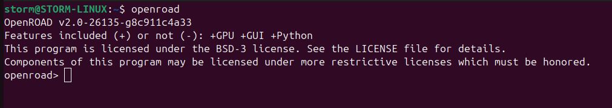
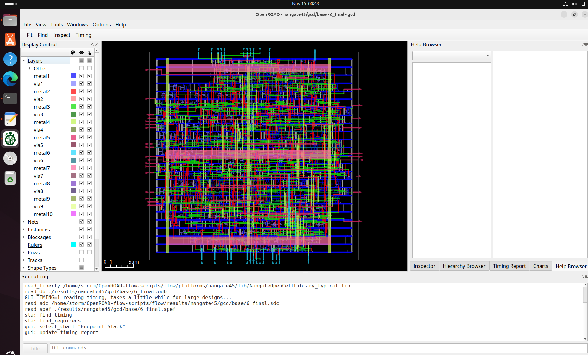

# Week 7 - My RISC-V SoC Tapeout Journey

**Author:** Goutham Badhrinath V  

---

## 📘 Baby SoC Physical Design

**Installing and setting up ORFS**

```
git clone --recursive https://github.com/The-OpenROAD-Project/OpenROAD-flow-scripts
cd OpenROAD-flow-scripts
sudo ./setup.sh
```

```
./build_openroad.sh --local
```


**Verify Installation**

```
source ./env.sh
yosys -help
openroad -help
cd flow
make
```


```
make gui_final
```



**ORFS Directory Structure and File formats**


``` 
├── OpenROAD-flow-scripts             
│   ├── docker           -> It has Docker based installation, run scripts and all saved here
│   ├── docs             -> Documentation for OpenROAD or its flow scripts.  
│   ├── flow             -> Files related to run RTL to GDS flow  
|   ├── jenkins          -> It contains the regression test designed for each build update
│   ├── tools            -> It contains all the required tools to run RTL to GDS flow
│   ├── etc              -> Has the dependency installer script and other things
│   ├── setup_env.sh     -> Its the source file to source all our OpenROAD rules to run the RTL to GDS flow
```

Now, go to flow directory

``` 
├── flow           
│   ├── design           -> It has built-in examples from RTL to GDS flow across different technology nodes
│   ├── makefile         -> The automated flow runs through makefile setup
│   ├── platform         -> It has different technology note libraries, lef files, GDS etc 
|   ├── tutorials        
│   ├── util            
│   ├── scripts             
```

Automated RTL2GDS Flow for VSDBabySoC:

Initial Steps:

- We need to create a directory `vsdbabysoc` inside `OpenROAD-flow-scripts/flow/designs/sky130hd`
- Now create a directory `vsdbabysoc` inside `OpenROAD-flow-scripts/flow/designs/src` and include all the verilog files here.
- Now copy the folders `gds`, `include`, `lef` and `lib` from the VSDBabySoC folder in your system into this directory.
  - The `gds` folder would contain the files `avsddac.gds` and `avsdpll.gds`
  - The `include` folder would contain the files `sandpiper.vh`, `sandpiper_gen.vh`, `sp_default.vh` and `sp_verilog.vh`
  - The `gds` folder would contain the files `avsddac.lef` and `avsdpll.lef`
  - The `lib` folder would contain the files `avsddac.lib` and `avsdpll.lib`
- Now copy the constraints file(`vsdbabysoc_synthesis.sdc`) from the VSDBabySoC folder in your system into this directory.
- Now copy the files(`macro.cfg` and `pin_order.cfg`) from the VSDBabySoC folder in your system into this directory.
- Now, create a `config.mk` file whose contents are shown below:

```
export DESIGN_NICKNAME = vsdbabysoc
export DESIGN_NAME = vsdbabysoc
export PLATFORM    = sky130hd

# export VERILOG_FILES_BLACKBOX = $(DESIGN_HOME)/src/$(DESIGN_NICKNAME)/IPs/*.v
# export VERILOG_FILES = $(sort $(wildcard $(DESIGN_HOME)/src/$(DESIGN_NICKNAME)/*.v))
# Explicitly list the Verilog files for synthesis
export VERILOG_FILES = $(DESIGN_HOME)/src/$(DESIGN_NICKNAME)/vsdbabysoc.v \
                       $(DESIGN_HOME)/src/$(DESIGN_NICKNAME)/rvmyth.v \
                       $(DESIGN_HOME)/src/$(DESIGN_NICKNAME)/clk_gate.v

export SDC_FILE      = $(DESIGN_HOME)/$(PLATFORM)/$(DESIGN_NICKNAME)/vsdbabysoc_synthesis.sdc

export vsdbabysoc_DIR = $(DESIGN_HOME)/$(PLATFORM)/$(DESIGN_NICKNAME)

export VERILOG_INCLUDE_DIRS = $(wildcard $(vsdbabysoc_DIR)/include/)
# export SDC_FILE      = $(wildcard $(vsdbabysoc_DIR)/sdc/*.sdc)
export ADDITIONAL_GDS  = $(wildcard $(vsdbabysoc_DIR)/gds/*.gds.gz)
export ADDITIONAL_LEFS  = $(wildcard $(vsdbabysoc_DIR)/lef/*.lef)
export ADDITIONAL_LIBS = $(wildcard $(vsdbabysoc_DIR)/lib/*.lib)
# export PDN_TCL = $(DESIGN_HOME)/$(PLATFORM)/$(DESIGN_NICKNAME)/pdn.tcl

# Clock Configuration (vsdbabysoc specific)
# export CLOCK_PERIOD = 20.0
export CLOCK_PORT = CLK
export CLOCK_NET = $(CLOCK_PORT)

# Floorplanning Configuration (vsdbabysoc specific)
export FP_PIN_ORDER_CFG = $(wildcard $(DESIGN_DIR)/pin_order.cfg)
# export FP_SIZING = absolute

export DIE_AREA   = 0 0 1600 1600
export CORE_AREA  = 20 20 1590 1590

# Placement Configuration (vsdbabysoc specific)
export MACRO_PLACEMENT_CFG = $(wildcard $(DESIGN_DIR)/macro.cfg)
export PLACE_PINS_ARGS = -exclude left:0-600 -exclude left:1000-1600: -exclude right:* -exclude top:* -exclude bottom:*
# export MACRO_PLACEMENT = $(DESIGN_HOME)/$(PLATFORM)/$(DESIGN_NICKNAME)/macro_placement.cfg

export TNS_END_PERCENT = 100
export REMOVE_ABC_BUFFERS = 1

# Magic Tool Configuration
export MAGIC_ZEROIZE_ORIGIN = 0
export MAGIC_EXT_USE_GDS = 1

# CTS tuning
export CTS_BUF_DISTANCE = 600
export SKIP_GATE_CLONING = 1

# export CORE_UTILIZATION=0.1  # Reduce this value to allow more whitespace for routing.
```

Now go to terminal and run the following commands:

```
cd OpenROAD-flow-scripts
source env.sh
cd flow
```

Commands for **synthesis**:

```
make DESIGN_CONFIG=./designs/sky130hd/vsdbabysoc/config.mk synth
```


Synthesis netlist:


Synthesis log:


Synthesis Check:


Synthesis Stats:


Commands for **floorplan**:

```
make DESIGN_CONFIG=./designs/sky130hd/vsdbabysoc/config.mk floorplan
```


```
make DESIGN_CONFIG=./designs/sky130hd/vsdbabysoc/config.mk gui_floorplan
```


```
make DESIGN_CONFIG=./designs/sky130hd/vsdbabysoc/config.mk place
```


```
make DESIGN_CONFIG=./designs/sky130hd/vsdbabysoc/config.mk gui_place
```


Heatmap:


```
make DESIGN_CONFIG=./designs/sky130hd/vsdbabysoc/config.mk cts
```


```
make DESIGN_CONFIG=./designs/sky130hd/vsdbabysoc/config.mk gui_cts
```


CTS final report:


